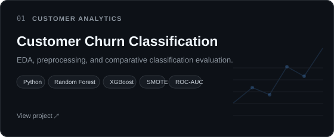
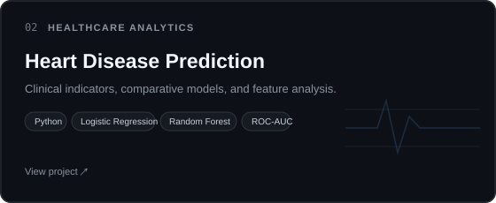
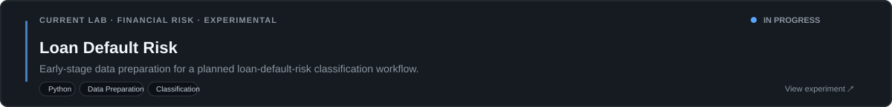

## Hi 👋 I'm Gabriel Afolabi

**Data Science &bull; Machine Learning &bull; Applied Analytics**

Exploring real-world data, building classification models, and turning patterns into interpretable insights.

---

## 👨🏾‍💻 About Me

- I explore applied machine learning and data analysis through classification problems.
- My workflow combines exploratory data analysis, preprocessing, and comparative model evaluation.
- The work spans customer analytics and healthcare analytics datasets.
- I am also experimenting with financial-risk data, currently through loan-default-risk preparation.

---

## 🧰 Tech Stack

  
  
  
  
  
  
  
  

**Technologies / Methods** 

---

## 🚀 Featured Projects

  
  

---

## 📊 GitHub Analytics

  

---

## 🧪 Current Lab

<i>Good models start with understanding the data.</i> GabeAfol &middot; <a href="https://github.com/GabeAfol">GitHub ↗</a>

